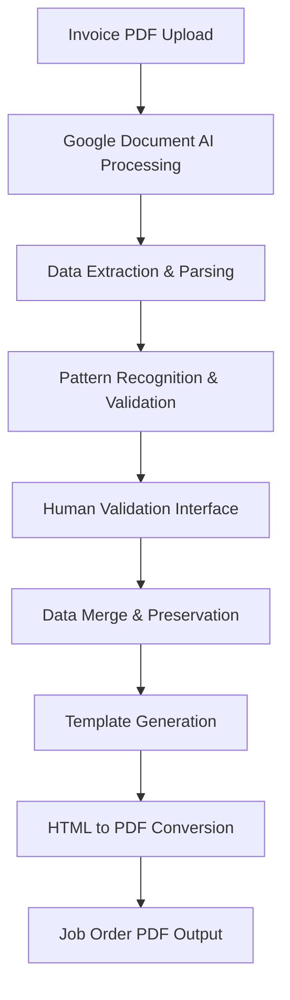

# Data Flow and Processing Pipeline

## Overview
This document details the complete data flow from invoice PDF input to Job Order PDF output, including all processing stages, data transformations, and decision points.

---

## High-Level Pipeline



---

## Stage 1: File Input & Upload

### Input Processing
**File**: `backend/app_v2.py` - `/upload` endpoint

```python
@app.route('/upload', methods=['POST'])
def upload_file():
    # File validation
    if 'file' not in request.files:
        return error_response('No file uploaded')
    
    file = request.files['file']
    if file.filename == '':
        return error_response('No file selected')
    
    # File extension validation
    if not allowed_file(file.filename):
        return error_response('Invalid file type')
    
    # Generate unique filename with timestamp
    timestamp = datetime.now().strftime('%Y%m%d_%H%M%S')
    filename = f"{timestamp}_INVOICE.pdf"
    file_path = os.path.join(app.config['UPLOAD_FOLDER'], filename)
    
    # Save file
    file.save(file_path)
```

**Validation Rules**:
- **File Types**: PDF, JPG, JPEG, PNG
- **Size Limit**: 16MB maximum
- **Naming Convention**: `YYYYMMDD_HHMMSS_INVOICE.pdf`
- **Storage**: Local `uploads/` directory

**Error Handling**:
- Invalid file type → 400 Bad Request
- File too large → 413 Request Entity Too Large
- No file selected → 400 Bad Request

---

## Stage 2: Google Document AI Processing

### Document AI Integration
**File**: `backend/google_document_ai.py` - `process_document()`

```python
def process_document(self, file_path: str) -> Dict[str, Any]:
    # 1. Document type detection
    doc_type = self.detect_document_type(file_path)
    self.processor_id = self.processors.get(doc_type, self.processors['general'])
    
    # 2. File reading and preparation
    with open(file_path, 'rb') as f:
        content = f.read()
    
    # 3. MIME type determination
    mime_type = self.determine_mime_type(file_path)
    
    # 4. Document AI API call
    raw_document = documentai.RawDocument(content=content, mime_type=mime_type)
    name = self.client.processor_path(self.project_id, self.location, self.processor_id)
    request = documentai.ProcessRequest(name=name, raw_document=raw_document)
    
    # 5. Process and extract
    result = self.client.process_document(request=request)
    extracted_data = self.extract_structured_data(result.document)
    
    return extracted_data
```

**Processing Configuration**:
- **Project ID**: `my-textbee-sms`
- **Location**: `us` (United States)
- **Processors**:
  - Invoice: `1699972f50f6529`
  - Form Parser: `81116d27ff6c4a06`
  - General: `81116d27ff6c4a06`

**Document Type Detection Logic**:
```python
def detect_document_type(self, file_path: str) -> str:
    filename = os.path.basename(file_path).lower()
    
    # Filename pattern matching
    if any(word in filename for word in ['quote', 'quotation', 'estimate']):
        return 'quote'
    elif any(word in filename for word in ['po', 'purchase_order']):
        return 'purchase_order'
    elif any(word in filename for word in ['invoice', 'bill', 'inv']):
        return 'invoice'
    
    # Content-based detection (fallback)
    # Extracts first 2 pages and searches for keywords
    return 'invoice'  # Default
```

---

## Stage 3: Data Extraction & Parsing

### Structured Data Extraction
**File**: `backend/google_document_ai.py` - `extract_structured_data()`

```python
def extract_structured_data(self, document) -> Dict[str, Any]:
    extracted = {
        'invoice_number': None,
        'po_number': None,
        'date': None,
        'vendor': {'name': None, 'address': None},
        'customer': {'name': None, 'address': None},
        'line_items': [],
        'total': None,
        'confidence_scores': {},
        'full_text': document.text
    }
    
    # Entity extraction from Document AI response
    for entity in document.entities:
        entity_type = entity.type_.lower()
        confidence = entity.confidence
        
        if entity_type in ['invoice_id', 'invoice_number']:
            extracted['invoice_number'] = entity.mention_text
            extracted['confidence_scores']['invoice_number'] = confidence
        # ... additional entity mappings
    
    return extracted
```

**Entity Mapping**:
- `invoice_id` → `invoice_number`
- `receiver_name` → `customer.name`
- `total_amount` → `total`
- `line_item` → `line_items[]`
- `invoice_date` → `date`

### Line Item Processing
```python
def extract_line_item(self, entity) -> Dict[str, Any]:
    item = {
        'description': None,
        'quantity': None,
        'unit_price': None,
        'amount': None,
        'size': None,
        'specifications': {}
    }
    
    # Extract properties from Document AI
    for prop in entity.properties:
        prop_type = prop.type_.lower()
        
        if prop_type in ['line_item/description', 'description']:
            item['description'] = prop.mention_text
            # Extract size from description
            item['size'] = self.extract_size(prop.mention_text)
        elif prop_type in ['line_item/quantity', 'quantity']:
            item['quantity'] = prop.mention_text
        # ... additional property mappings
    
    # Extract door specifications from description
    if item['description']:
        item['specifications'] = self.extract_specifications(item['description'])
    
    return item
```

---

## Stage 4: Pattern Recognition & Validation

### Size Extraction Pipeline
**File**: `backend/google_document_ai.py` - `extract_size()`

```python
def extract_size(self, text: str) -> Optional[str]:
    import re
    
    # Patterns ordered by specificity (most specific first)
    patterns = [
        r'(\d+)[mM][mM]\s*[xX]\s*(\d+)\s*[fF][tT]\s*[xX]\s*(\d+)\s*[fF][tT]',  # 43MM X 3FT X 8FT
        r'(\d+)\s*[mM][mM]\s*[xX]\s*(\d+)\s*[mM][mM]',                          # 850mm x 2100mm
        r'(\d+)\s*[xX]\s*(\d+)\s*[mM][mM]',                                     # 850x2100mm
        r'(\d+)\s*[xX]\s*(\d+)',                                                 # 850x2100
        r'(\d+)[mM][mM]\s*[xX]\s*(\d+)\s*[fF][tT]',                            # 43mm x 8ft
        r'(\d+)\s*[fF][tT]\s*[xX]\s*(\d+)\s*[fF][tT]',                         # 3ft x 8ft
    ]
    
    for pattern in patterns:
        match = re.search(pattern, text, re.IGNORECASE)
        if match:
            # Handle feet conversion if pattern contains feet
            if '[fF][tT]' in pattern or 'ft' in pattern.lower():
                return self.convert_feet_to_mm(match)
            else:
                return f"{match.group(1)}MM x {match.group(2)}MM"
    
    return None
```

**Feet to MM Conversion**:
```python
def convert_feet_to_mm(self, match):
    if len(match.groups()) == 3:  # 43MM X 3FT X 8FT format
        thickness = match.group(1)
        width_ft = int(match.group(2))
        height_ft = int(match.group(3))
        width_mm = width_ft * 305  # 1 foot ≈ 305mm
        height_mm = height_ft * 305
        return f"{width_mm}MM x {height_mm}MM"
    elif len(match.groups()) == 2:
        # Handle mixed or pure feet formats
        # ... conversion logic
    return converted_size
```

**Example Conversions**:
- `"43MM X 3FT X 8FT"` → `"915MM x 2440MM"`
- `"850MM x 2100MM"` → `"850MM x 2100MM"` (no change)
- `"3FT X 8FT"` → `"915MM x 2440MM"`

### Specification Extraction
```python
def extract_specifications(self, description: str) -> Dict[str, str]:
    specs = {}
    desc_lower = description.lower()
    
    # Door thickness patterns
    thickness_patterns = [
        r'(\d+)mm\s*thick',
        r'thickness[:\s]*(\d+)mm',
        r'(\d+)\s*mm\s*door',
        r'door\s*(\d+)mm',
        r'(\d+)\s*mm(?:\s|$)',
    ]
    
    for pattern in thickness_patterns:
        match = re.search(pattern, desc_lower)
        if match:
            thickness = match.group(1)
            if thickness in ['37', '43', '46', '48']:
                specs['thickness'] = f'{thickness}mm'
                break
    
    # Door type detection
    if any(term in desc_lower for term in ['s/l', 'single leaf']):
        specs['type'] = 'S/L'
    elif any(term in desc_lower for term in ['d/l', 'double leaf']):
        specs['type'] = 'Unequal D/L' if 'unequal' in desc_lower else 'D/L'
    
    # Door core detection
    if any(term in desc_lower for term in ['honeycomb', 'honey comb']):
        specs['core'] = 'honeycomb'
    elif any(term in desc_lower for term in ['solid tubular', 'tubular core']):
        specs['core'] = 'solid_tubular'
    elif any(term in desc_lower for term in ['solid timber', 'timber core']):
        specs['core'] = 'solid_timber'
    
    return specs
```

### Malaysian Business Pattern Recognition
```python
def extract_malaysian_patterns(self, extracted: Dict, text: str) -> Dict:
    # Company name extraction
    company_patterns = ['sdn bhd', 'sdn. bhd.', 'bhd', 'enterprise', 'trading']
    
    # Bill To section patterns
    bill_to_patterns = [
        r'bill\s+to[:\s]+([^\n]+(?:sdn\s+bhd|bhd|enterprise|trading)[^\n]*)',
        r'customer[:\s]+([^\n]+(?:sdn\s+bhd|bhd|enterprise|trading)[^\n]*)',
        r'sold\s+to[:\s]+([^\n]+(?:sdn\s+bhd|bhd|enterprise|trading)[^\n]*)',
    ]
    
    # Search and extract company names
    for pattern in bill_to_patterns:
        match = re.search(pattern, text.lower(), re.IGNORECASE)
        if match:
            company_name = match.group(1).strip().upper()
            if not self.is_sendora_text(company_name):
                extracted['customer']['name'] = company_name
                break
    
    return extracted
```

### Data Aggregation
```python
def aggregate_door_specifications(self, extracted: Dict) -> Dict:
    aggregated_specs = {
        'door_thickness': '',
        'door_type': '',
        'door_core': '',
        'door_size': '',
        'item_desc_0': '',
        'item_size_0': ''
    }
    
    # Process line items to extract common specifications
    for item in extracted.get('line_items', []):
        specs = item.get('specifications', {})
        description = item.get('description', '')
        
        # Find main door item
        if 'door' in description.lower() or specs.get('thickness'):
            aggregated_specs['item_desc_0'] = description
            
            # Extract size from this item
            item_size = item.get('size') or self.extract_size(description)
            if item_size:
                aggregated_specs['item_size_0'] = item_size
                aggregated_specs['door_size'] = item_size
            
            # Aggregate specifications
            if specs.get('thickness') and not aggregated_specs['door_thickness']:
                aggregated_specs['door_thickness'] = specs['thickness']
            # ... additional spec aggregation
    
    # Fallback: extract size from full text
    if not aggregated_specs['door_size']:
        door_size_match = re.search(r'door\s+size[:\s]*([^\n]+)', 
                                   extracted.get('full_text', ''), re.IGNORECASE)
        if door_size_match:
            extracted_size = self.extract_size(door_size_match.group(1))
            if extracted_size:
                aggregated_specs['door_size'] = extracted_size
    
    extracted.update(aggregated_specs)
    return extracted
```

---

## Stage 5: Human Validation Interface

### Session Management
**File**: `backend/app_v2.py`

```python
# Global session storage
validation_sessions = {}

@app.route('/upload', methods=['POST'])
def upload_file():
    # ... file processing ...
    
    # Create validation session
    session_id = str(uuid.uuid4())
    validation_sessions[session_id] = {
        'file_path': file_path,
        'extracted_data': extracted_data,
        'timestamp': datetime.now(),
        'status': 'pending_validation'
    }
    
    return jsonify({
        'success': True,
        'session_id': session_id,
        'validation_url': f'/validate/{session_id}'
    })
```

### Validation Interface
**File**: `frontend/validation.html`

```html
<!-- Dynamic form generation based on extracted data -->
<form method="POST" action="/validate/{{ session_id }}">
    <!-- Header fields -->
    <input type="text" name="invoice_number" value="{{ data.invoice_number }}" required>
    <input type="text" name="customer_name" value="{{ data.customer.name }}">
    <input type="date" name="document_date" value="{{ data.date }}">
    
    <!-- Door specifications -->
    <input type="text" name="door_thickness" value="{{ data.door_thickness }}">
    <input type="text" name="door_type" value="{{ data.door_type }}">
    <input type="text" name="door_core" value="{{ data.door_core }}">
    <input type="text" name="door_size" value="{{ data.door_size }}">
    
    <!-- Line items (dynamic) -->
    
    <div class="line-item">
        <input type="text" name="item_desc_{{ loop.index0 }}" value="{{ item.description }}">
        <input type="text" name="item_size_{{ loop.index0 }}" value="{{ item.size }}">
        <input type="number" name="item_qty_{{ loop.index0 }}" value="{{ item.quantity }}">
    </div>
    
    
    <button type="submit">Generate Job Order</button>
</form>
```

**Confidence Score Display**:
```python
# Color-coded confidence indicators
def get_confidence_class(confidence):
    if confidence >= 0.8:
        return 'high-confidence'  # Green
    elif confidence >= 0.6:
        return 'medium-confidence'  # Yellow
    else:
        return 'low-confidence'  # Red
```

---

## Stage 6: Data Merge & Preservation

### Critical Data Preservation
**File**: `backend/app_v2.py` - `/validate/<session_id>` POST handler

```python
@app.route('/validate/<session_id>', methods=['POST'])
def validate_data(session_id):
    # Get original extracted data
    session_data = validation_sessions.get(session_id)
    original_extracted_data = session_data['extracted_data']
    
    # Get form-submitted data
    form_data = request.form.to_dict()
    validated_data = {}
    
    # Process form data
    for key, value in form_data.items():
        if value and value.strip():
            validated_data[key] = value
    
    # CRITICAL: Preserve original extracted specifications
    specifications_to_preserve = [
        'door_thickness', 'door_type', 'door_core', 'door_edging',
        'decorative_line', 'frame_type', 'line_items', 'door_size',
        'item_size_0', 'item_desc_0'  # These were missing and caused issues
    ]
    
    for spec in specifications_to_preserve:
        if spec in original_extracted_data and original_extracted_data[spec]:
            # Only use original data if validated data doesn't have this field
            if spec not in validated_data or not validated_data[spec]:
                validated_data[spec] = original_extracted_data[spec]
                print(f"PRESERVED from original extraction: {spec} = {original_extracted_data[spec]}")
    
    return validated_data
```

**Data Merge Logic**:
1. **Form data takes priority** - User corrections override OCR
2. **Preserve missing fields** - OCR data fills gaps in form submission
3. **Specifications priority** - Complex extracted specs (door_size, etc.) preserved
4. **Line items preservation** - Complete line item data maintained

**Debug Output**:
```python
print(f"MERGED DATA: door_thickness = '{validated_data.get('door_thickness', '')}'")
print(f"MERGED DATA: door_type = '{validated_data.get('door_type', '')}'")
print(f"MERGED DATA: door_core = '{validated_data.get('door_core', '')}'")
print(f"MERGED DATA: door_size = '{validated_data.get('door_size', '')}'")
```

---

## Stage 7: Template Generation

### Template Data Preparation
**File**: `backend/simple_working_template.py` - `create_working_template()`

```python
def create_working_template(self, data: Dict[str, Any]) -> str:
    # Extract and map data
    job_order_no = data.get('invoice_number', '')
    customer_name = data.get('customer_name', '')
    door_thickness = data.get('door_thickness', '').lower()
    door_type = data.get('door_type', '').lower()
    door_core = data.get('door_core', '').lower()
    door_size = data.get('door_size', '') or data.get('item_size_0', '')
    
    # Generate checkbox states
    thickness_43 = "checked" if "43" in door_thickness else ""
    type_sl = "checked" if "s/l" in door_type else ""
    core_tubular = "checked" if "tubular" in door_core else ""
    
    # Generate HTML template
    return self.generate_html_template(...)
```

**Checkbox State Logic**:
```python
# Door thickness checkboxes
thickness_37 = "checked" if "37" in door_thickness else ""
thickness_43 = "checked" if "43" in door_thickness else ""
thickness_46 = "checked" if "46" in door_thickness else ""

# Door type checkboxes
type_sl = "checked" if "s/l" in door_type else ""
type_dl = "checked" if "d/l" in door_type and "unequal" not in door_type else ""
type_unequal = "checked" if "unequal" in door_type else ""

# Door core checkboxes
core_honeycomb = "checked" if "honeycomb" in door_core else ""
core_tubular = "checked" if "tubular" in door_core else ""
core_timber = "checked" if "timber" in door_core else ""
core_metal = "checked" if "metal" in door_core else ""
```

### HTML Template Generation
```python
def generate_html_template(self, data):
    return f'''<!DOCTYPE html>
<html>
<head>
    <meta charset="UTF-8">
    <title>Sendora Job Order</title>
    <style>
        /* Professional styling */
        body {{ font-family: Arial, sans-serif; font-size: 10px; }}
        .page {{ width: 190mm; min-height: 270mm; }}
        .checkbox.checked {{ background-color: #000; }}
        .door-size {{ font-size: 9px; font-weight: bold; }}
    </style>
</head>
<body>
    <div class="page">
        <!-- Header -->
        <div class="company-name">SENDORA GROUP SDN BHD (KOTA DAMANSARA)</div>
        
        <!-- Form fields -->
        <span class="field-value">{job_order_no}</span>
        <span class="field-value">{customer_name}</span>
        
        <!-- Door specifications table -->
        <table class="main-table">
            <tr>
                <td>
                    <div class="checkbox-section">
                        <span class="checkbox {thickness_43}"></span>43mm
                    </div>
                </td>
                <td>
                    <div class="door-size">{door_size}</div>
                    <div class="circle-number">①</div>
                </td>
            </tr>
        </table>
    </div>
</body>
</html>'''
```

---

## Stage 8: HTML to PDF Conversion

### PDF Generation Process
**File**: `backend/simple_working_template.py` - `generate_working_jo()`

```python
def generate_working_jo(self, validated_data: Dict[str, Any]) -> str:
    timestamp = datetime.now().strftime('%Y%m%d_%H%M%S')
    html_filename = f"JO_WORKING_{timestamp}.html"
    html_path = os.path.join(self.output_dir, html_filename)
    
    # Generate HTML content
    html_content = self.create_working_template(validated_data)
    
    # Save HTML file
    with open(html_path, 'w', encoding='utf-8') as f:
        f.write(html_content)
    
    # Convert to PDF using wkhtmltopdf
    pdf_filename = html_filename.replace('.html', '.pdf')
    pdf_path = os.path.join(self.output_dir, 'pdf', pdf_filename)
    
    wkhtmltopdf_cmd = [
        r"C:\Program Files\wkhtmltopdf\bin\wkhtmltopdf.exe",
        "--page-size", "A4",
        "--margin-top", "8mm",
        "--margin-bottom", "8mm",
        "--margin-left", "8mm",
        "--margin-right", "8mm",
        "--encoding", "UTF-8",
        "--enable-local-file-access",
        html_path,
        pdf_path
    ]
    
    subprocess.run(wkhtmltopdf_cmd, check=True)
    
    return html_path
```

**PDF Conversion Parameters**:
- **Page Size**: A4 (210 × 297 mm)
- **Margins**: 8mm all sides
- **Encoding**: UTF-8 for international characters
- **Local Access**: Enabled for CSS and images
- **Quality**: High resolution for printing

---

## Stage 9: Output & Delivery

### File Organization
```
job_orders/
├── JO_WORKING_20250815_123456.html    # HTML template
├── pdf/
│   └── JO_WORKING_20250815_123456.pdf  # Final PDF output
└── [previous generated files...]
```

### Response & Download
```python
@app.route('/download/<filename>')
def download_file(filename):
    try:
        return send_from_directory(
            app.config['OUTPUT_FOLDER'],
            filename,
            as_attachment=True,
            download_name=f"Sendora_JO_{filename}"
        )
    except FileNotFoundError:
        return jsonify({'error': 'File not found'}), 404
```

---

## Error Handling & Fallback

### Processing Error Handling
```python
def process_with_fallback(file_path):
    try:
        # Primary: Google Document AI
        result = google_processor.process_document(file_path)
        print("Processed with Google Document AI")
        return result
    except Exception as e:
        print(f"Google Document AI failed: {e}")
        
        try:
            # Fallback: Azure Form Recognizer
            result = azure_processor.process_document(file_path)
            print("Processed with Azure Form Recognizer (fallback)")
            return result
        except Exception as e2:
            print(f"Azure fallback also failed: {e2}")
            
            # Final fallback: Demo data
            return generate_demo_data()
```

### Template Fallback
```python
def safe_template_generation(data):
    try:
        return self.create_working_template(data)
    except Exception as e:
        logger.error(f"Template generation failed: {e}")
        # Return basic template with available data
        return self.create_basic_template(data)
```

---

## Performance Monitoring

### Processing Metrics
```python
# Processing time tracking
start_time = time.time()

# OCR processing
ocr_start = time.time()
extracted_data = processor.process_document(file_path)
ocr_time = time.time() - ocr_start

# Template generation
template_start = time.time()
html_content = generator.create_template(data)
template_time = time.time() - template_start

# PDF conversion
pdf_start = time.time()
pdf_path = converter.html_to_pdf(html_content)
pdf_time = time.time() - pdf_start

total_time = time.time() - start_time

# Log performance metrics
logger.info(f"Processing completed in {total_time:.2f}s")
logger.info(f"OCR: {ocr_time:.2f}s, Template: {template_time:.2f}s, PDF: {pdf_time:.2f}s")
```

### Quality Metrics
```python
# Confidence score tracking
confidence_scores = extracted_data.get('confidence_scores', {})
avg_confidence = sum(confidence_scores.values()) / len(confidence_scores)

if avg_confidence < 0.6:
    logger.warning(f"Low confidence extraction: {avg_confidence:.2f}")
    # Flag for manual review

# Field completion tracking
required_fields = ['invoice_number', 'customer_name', 'door_size', 'door_thickness']
completion_rate = sum(1 for field in required_fields if extracted_data.get(field)) / len(required_fields)

logger.info(f"Field completion rate: {completion_rate:.1%}")
```

---

## Data Validation & Quality Control

### Input Validation Pipeline
1. **File Format Validation**: PDF, JPG, PNG only
2. **Size Validation**: Max 16MB
3. **Content Validation**: Document AI confidence scores
4. **Pattern Validation**: Regex pattern matching for sizes, specifications
5. **Business Rules Validation**: Malaysian company patterns, Sendora filtering

### Output Quality Assurance
1. **Template Validation**: HTML structure validation
2. **Data Completeness**: Required fields present
3. **PDF Generation**: Successful conversion verification
4. **File Integrity**: Output file size and format checks

---

*Complete data flow and processing pipeline documentation for Sendora OCR Complete Project*